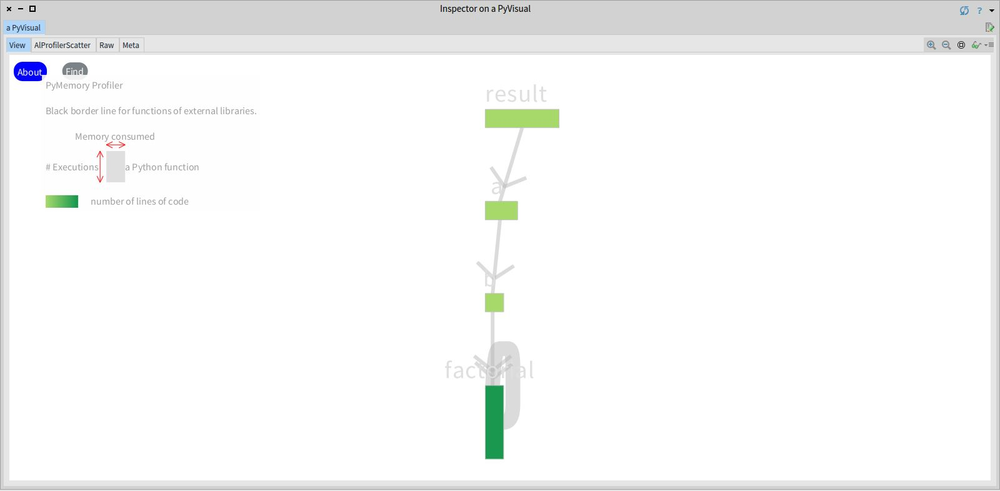
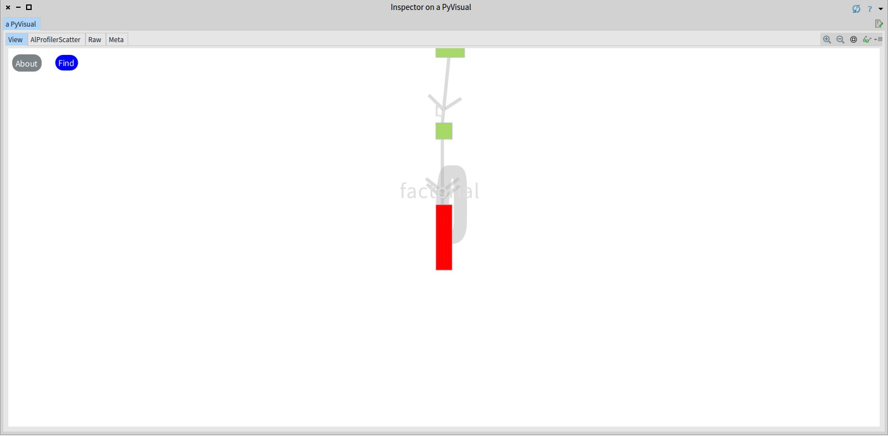
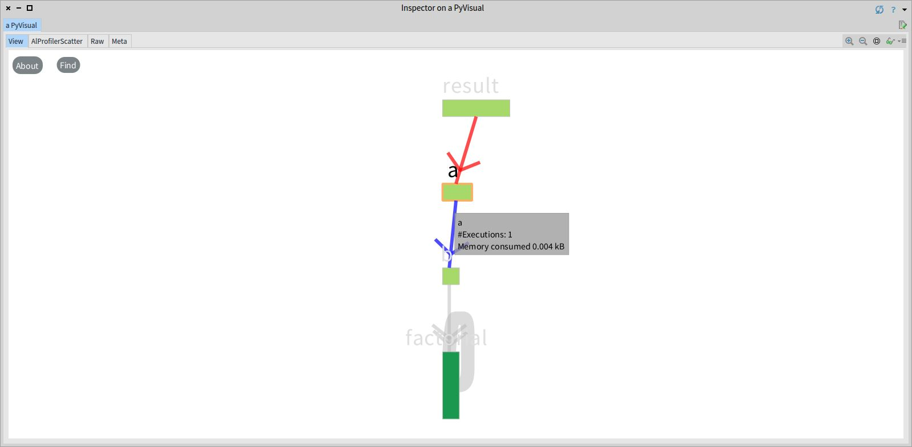
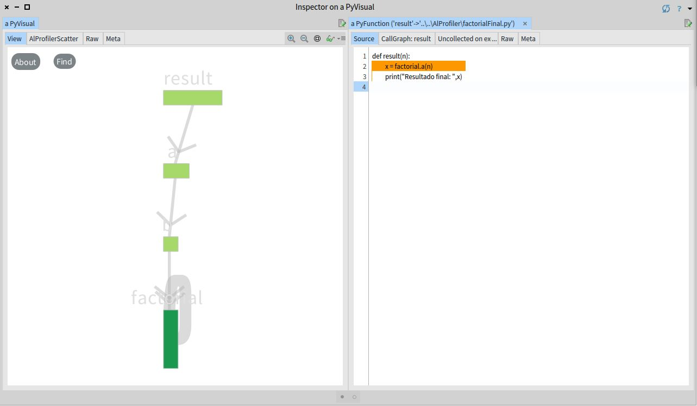
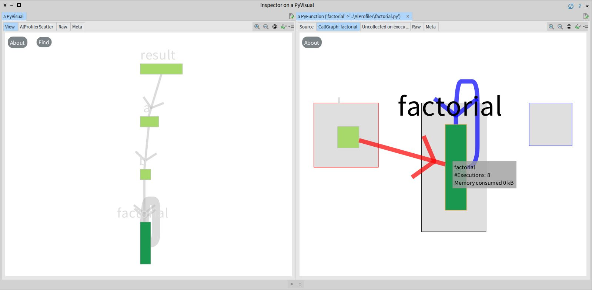
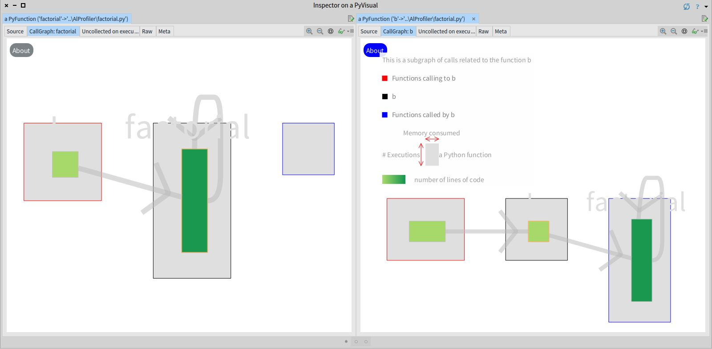
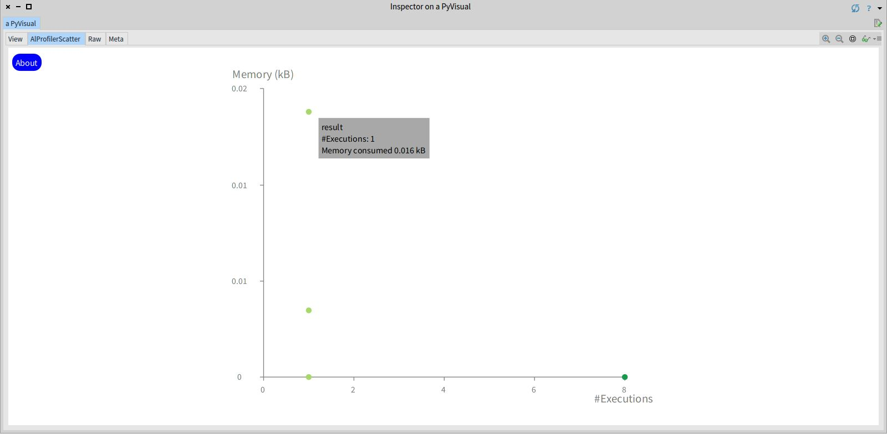

# AlProfiler

**Reading time: 3-5 minutes.**

AlProfiler is a memory profiler that helps programmers to understand the memory consumption of Python applications by interactive visualizations.

AlProfiler runs on top of [Pharo](http://pharo.org), the live programming environment.

## System requirements
Running AlProfiler needs Python 3.X and git.

Also, according to your Operative System, download and unzip the standalone from this [Dropbox](https://www.dropbox.com/sh/0fcpw87wfkn3p2n/AABhROrMdwnhR4-aP1e0nrNNa?dl=0).

## How to use

#### 1. Run AlProfiler: 

Open a terminal and execute the following script: 

```
path/to/<runProfiler script> path/to/PrincipalFile.py runFunction argumentsFunction
```
AlProfiler needs the path of the runProfiler script from the standalone (on the standalone directory you downloaded from Dropbox in System requirements there is a script called runProfiler.bat in Windows or runProfiler.sh in Linux/MAC), principal python file (PrincipalFile.py), the running function of the application from the principal python file (runFunction) and, if it's necessary, the arguments for the function (argumentsFunction).

**Examples**:

**Windows**
```
./runProfiler.bat example.py main
```

or

```
./runProfiler.bat example.py main 1 2 3
```

**Linux/MAC**
```
./runProfiler.sh example.py main
```

or

```
./runProfiler.sh example.py main 1 2 3
```

This will generate a directory AlProfiler_example with three .csv files in the directory you are currently in.

#### 2. Start AlProfiler: 

On the standalone directory you downloaded and unzipped from the Dropbox in System requirements, double click the executable Pharo.exe (for Windows), pharo (for Linux) or Pharo (for MAC at Pharo.app/Contents/MacOS on the directory downloaded and unzipped). Select the PyMemory menu and open the directory generated by AlProfiler mentioned before by clicking the OK button. If the double click doesn't work, open a terminal and execute the following script (consider that Pharo.exe-pharo-Pharo.app/Contents/MacOS/Pharo and Visualization.image are in the directory downloaded from the Dropbox):

**Windows**
```
path/to/Pharo.exe path/to/Visualization.image
```
For example, if you are on the standalone directory downloaded from Dropbox, the script will be:
```
./Pharo.exe ./Visualization.image
```

**Linux**
```
path/to/pharo path/to/Visualization.image
```
For example, if you are on the standalone directory downloaded from Dropbox, the script will be:
```
./pharo Visualization.image 
```
**MAC**
```
path/to/Pharo.app/Contents/MacOS/Pharo path/to/Visualization.image
```

For example, if you are on the standalone directory downloaded from Dropbox, the script will be:
```
./Pharo.app/Contents/MacOS/Pharo Visualization.image
```

## Visualization

It will display a visual mapping of the application in graph form followed by the option to explore a memory scatter plot, like the following image: 



In this example, the application has a running function *result* calling method *a* calling a method *b* calling a recursive *factorial*.

**Nodes**: Each node represents a method invoked over the application execution. Consider the previous image, where each function is represented by an unique node, where:

- The width is proportional to the memory consumed by this function.
- The height is proportional to the number of executions.
- Their color fades between a dark green to lighter green to represent the number of lines of code defining the function (the fewer lines the lighter green).

**Edges**: Represents the calling relationship between functions using an arrow to indicate the direction of the call. Also, a width as a visual cue of the number of calls between two functions. For example, in the figure above, the method *factorial* calls itself more times than *b* calls *factorial*.

**Layout**: The visualization uses as default a vertical layout that places the nodes in order to represent the functions that call another one and the order of execution. Consequently the relation between callers and callees is made from top to bottom and the order of execution is given from left to right.

**Interactions**: The call graph nodes offers the following interactions:

- The function name is placed above each node, and disappear if zoom out is used.
- **Search**: In the "Find" button you can search for a specific method where you can find a search bar and the names of the functions executed. The result of the search is presented by partially highlighting the node in a red color. For example, in the following figure the *factorial* function was searched and found.



- When the cursor hovers a node, a popup window appears showing the name, the number of executions, and the amount of memory consumed in Kilobytes (kB). It also highlights the color of the border node, the incoming edges change to red and the outgoing to blue. All this like the following image.



- **Selection and draggable**: When holding a node, you can drag it and the nodes involved with blue edges. Clicking the node presents other interactions:
    
    - **Source code**: Clicking on a node also displays a visualization of the source code annotated with dynamic information. This visualization highlights enumerated code lines that allocates memory. The highlighting color fades from dark orange to light gray and if there is none memory allocated is white, like the following figure.
 
    
    
    - **Navigation**: A navigation option is presented with a sub call graph of the selected node, where the node is encapsulated on a centered box, at the left with a red border are nested the nodes that call to the selected node and at the right with a blue border are nested the nodes called by the selected node, like in the next figure where *factorial* function was selected and then the *b* function from the nodes that call *factorial*, and each node of the sub call graph supports this interaction. 
    
     

**Memory scatter plot**: The relation between memory consumed and function execution times is indicated by a scatter plot, each function is represented as a point placed according to the memory consumed and the number of executions on the Y and X axes, respectively and each point supports the interactions previously described. For example, the next image:


